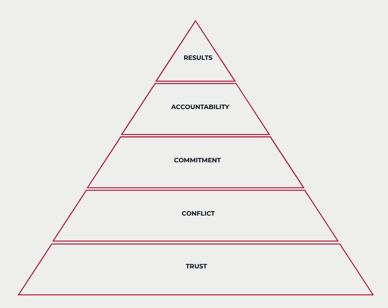

## A key book that helps us maintain healthy company culture

Every year BAM participates in the Happy At Work survey. This external and anonymous survey assesses employee satisfaction. Our last year results showed us that people appreciate the company culture. We scored more than 90% on the quality of interpersonal relations, company culture and trust in management. These results are consistent with the ones we had previous years and we score high above market benchmarks.

There are a lot of factors that contribute to this success, but there is one I wanted to put forward - a book. Every employee that arrives at BAM receives a copy of _The Five Dysfunctions of a Team_ by Patrick Lencioni. The same book Fabrice Bernhard gave me 10 years ago when I first became manager at Theodo. This book is one of the basis of our company culture.

Our culture is articulated around 3 values: “Teamwork”, “Pragmatism” and “Desire to Learn and Progress”. Teamwork's interpretation is based on this book. The five elements that we strive to implement daily are: trust, conflict, commitment, accountability and attention to results.

|                                                    |
| :-----------------------------------------------------------------------------------------------------------------------------------------------------------: |
| Source : [https://www.tablegroup.com/topics-and-resources/teamwork-5-dysfunctions/](https://www.tablegroup.com/topics-and-resources/teamwork-5-dysfunctions/) |

## Implementing _Five Dysfunctions of a Team_ at BAM

Values only matter if people apply them in their daily life. Here are some examples of things we do that are inspired by Lencioni's book.

**Trust : Being quick to admit an error or a weakness and move on.** The first days at BAM you learn that admitting error is not only allowed but also expected of you. As a junior developer joining our team you start with a self-training. You have a set of tasks that you should do independently. At the end of the day you have a meeting with your coach who reviews your achievement. If you don't meet the target, the first question is: why didn't you (_*andon*_)[^andon] during the day? We teach new bamers that autonomy means also being able to call for help at the right time.

[^andon]: We use the lean term andon to signify calling for help in case of an unexpected problem.

**Conflict : Present suggested solutions to get challenges.** While working to solve a problem, we challenge the solutions we propose with other members of the team. For example, a technical decision that is important for a project will be often done using the ADR[^adr] framework. This creates a _*conflict*_ that lets every person in the team share her insights and challenge given decision. There is no official hierarchy in a group decision. The same goes for our executive committee - every decision is presented in a A3 format[^a3] to get feedback. Only then, after including other points of view, the team commits to a decision together.

[^adr]: For more see https://adr.github.io/
[^a3]: See "Planet Lean: What is A3 thinking": https://planet-lean.com/what-is-a3-thinking/

**Commitment : Fixing clear and tight timelines.** Every development task at BAM should be smaller than 1 day. It is a standard that is adopted consistently and exists since the company creation. At a daily standup there is only one possible state of yesterday's tickets: they are done or not. If they are not done, this signals a problem and the team can start focusing on understanding its causes and addressing them.

We try to apply the rule also to other activities: planning software deployments (what content on what date?), fixing a number of recruited people per month in our growth team, giving maximum time for a commercial proposal to be written.

The benefits are twofold: on one hand we focus on how to bring value faster to our clients. On the other, we are creating a feedback loop that reinforces collaboration and learning.

**Accountability : Asking “Why is it not done yet? Why didn’t you succeed?”.** We give commitments and we try to make them ambitious. Sometimes we fail to achieve them. But is what comes after that is especially important.
At BAM you can fail a task and most of the time there are no big consequences. But one question will come inevitably: why? Like the last month, where I failed my content creation objectives. I wanted to write 2 articles for my blog and I had published only one. So my team asked me: what reasons explain that you didn’t manage to do that? How will you improve in the future?
This is an exercise in modesty, vulnerability and learning. But by holding each other accountable we are constantly challenging our teammates to get better.

**Attention to results : Trying to understand the bigger picture and rest focused on it.** In every project we ask our client about the definition of success. Why is this project important? How many users do you want? How will they bring you money?
We do it because we want our relation the be more than a client - contractor. We want every feature we develop to help the project achieve its success, suggest better solutions, prioritise together to get the best result. The attention to results is more than being able to deliver a feature on time, it is about making the right choices at every moment.

**Frequently going back to the pyramid framework.** All our leadership seminars include looking at the pyramid and asking ourselves: on which part were we good at in the last few months? Which parts need improvement? It is a way to start a team retrospective. This helps us to put spotlight on problems that we didn't have time or didn't want to address before. Misunderstandings and diverging visions in the leadership team, lacking teamwork, failed objectives. And every time we emerge as better team after these discussions.

## **Enabling teamwork on organisation level**

This culture is not a given thing - as all things in a company it is constantly fluctuating. We have created various tools and processes to help us foster it.

**Adapt recruitment process.** Our recruitment process evaluates specifically for the values, with some questions directly probing for the person's Teamwork attitude. One of the questions is "What was your biggest failure?". The question may seem cliché, but the way a person reacts to it (more that what she says) is a key factor in our recruitment. Interviews are engineered to also asses other points: how does the candidate behave when faced with a task too hard ? Is the candidate able to give feedback to the recruiter if asked? These tests help us to filter out "brilliant jerks" and detect people who are open to learning and creating candid relations.

**Include a dedicated onboarding on values.** Every bamer that arrives gets a copy of “The Five Dysfunctions of a Team”. And his or her manager will have a discussion about it early on. This helps to deepen the understanding of the book and explain some of the behaviours the person will see in the workplace.

**Create rituals that rely on the framework in daily work.** When creating job rituals we keep the framework in mind: you should commit yourself on your tasks at the end of every daily or weekly. The follow-up should be built in. Each important problem should have an indicator that will be followed to keep focused on the result. All proposed actions should have the intended consequence so we can evaluate if has been implemented and it worked. In that way, Lencioni’s book fits in greatly with Lean philosophy and its tools: Problem Solving, PDCAs, A3s, visual management.

**Include it in progression framework.** One of the most important things is to align the promotion system with the values. In our company, each promoted person needs to pass a positive evaluation on values, including teamwork. Our peer reviews include questions like: "When was the last time you were challenged by this person?", "How does this person react to critique?", "Is she focused on team objectives?".

**Regular management training.** All managers at BAM have access to weekly trainings on coaching. These include: deepening the understanding of BAM values, how to react if someone is not acting according to values. This helps to re-align people with company culture.

## The results

So what does this all give? I have already written at the beginning that the culture is greatly appreciated by our employees. But there is more. This culture enables quick feedback loops, giving more opportunities for learning and error-correction. It fosters psychological safety by making it normal to speak about one's difficulties. And it helps improve performance by quickly helping team members that are stuck. So we continue to buy and give a copy of "Five Dysfunctions" to every new bamer and we are grateful to Patick Lencioni for his work. And I hope one day Patrick Lencioni will send us an autographed poster, we have already bought more than 200 copies!
